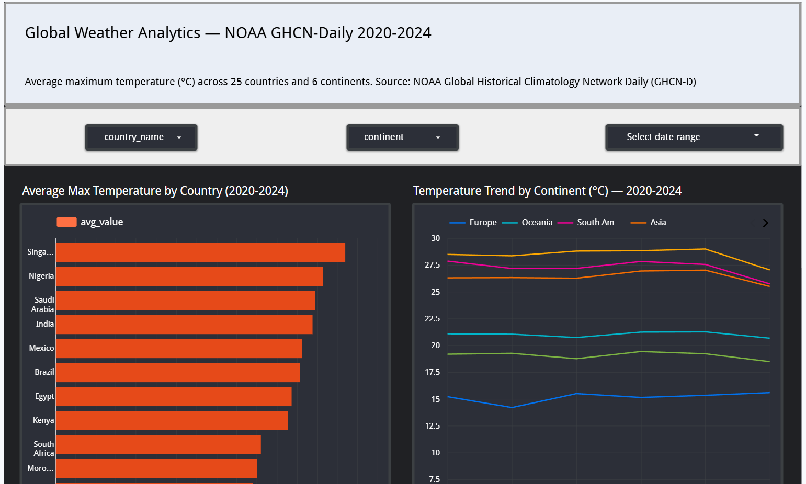
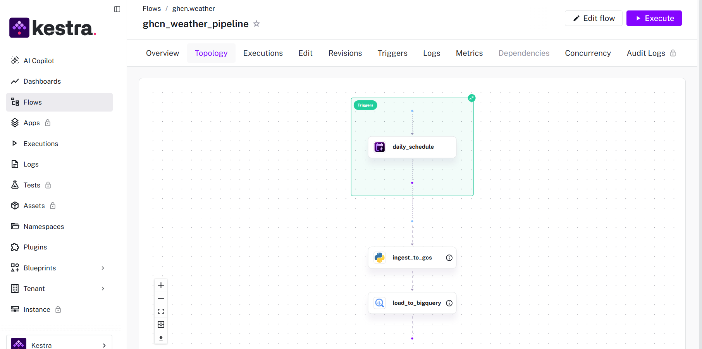
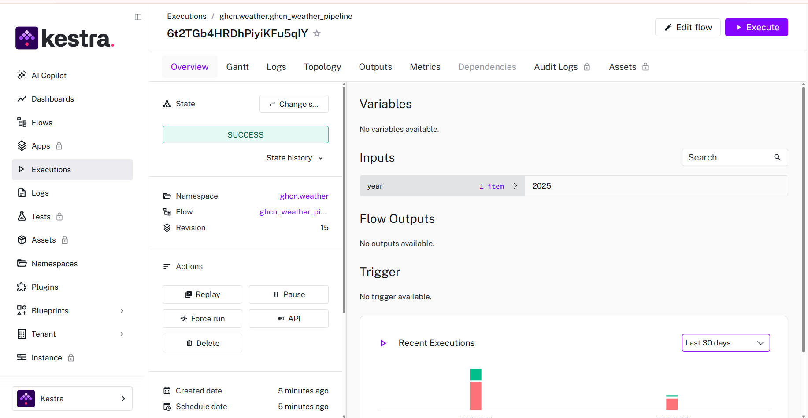
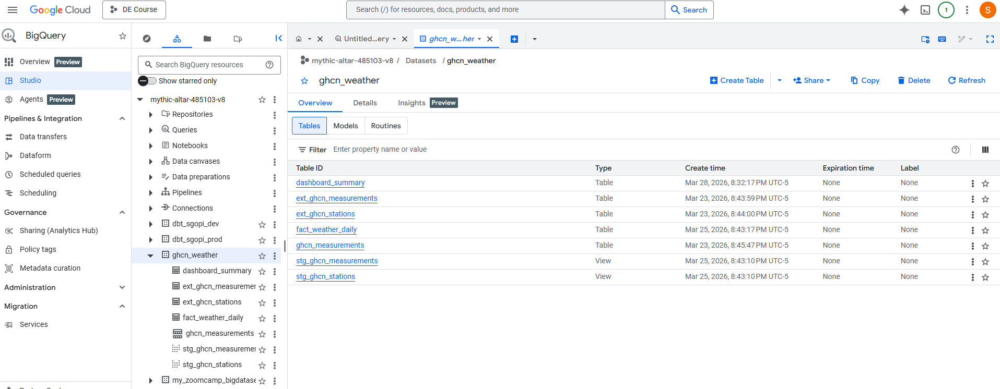

# Global Weather Analytics — NOAA GHCN-Daily Pipeline

An end-to-end data pipeline that ingests 187 million daily weather observations
from NOAA's GHCN-Daily dataset, applies quality filtering and unit standardization
via dbt, and surfaces global temperature trends in an interactive Looker Studio dashboard.

## Problem Statement

Climate patterns are shifting globally, but understanding these changes requires
processing massive amounts of raw sensor data from thousands of weather stations
worldwide. NOAA's Global Historical Climatology Network Daily (GHCN-D) dataset
contains over 187 million daily observations across 129,657 stations — but the
raw data has significant challenges:

- Data is spread across yearly CSV files totalling 6.4 GB
- Measurements use non-standard units (tenths of degrees Celsius, tenths of mm)
- ~0.1% of readings carry quality flags indicating failed QA checks (ie around 203,000 records)
- Station metadata uses cryptic FIPS country codes with no country names
- No direct way to query or visualize without significant processing

This project answers the following analytical questions:
1. Which countries and continents have the highest average maximum temperatures?
2. How have global temperatures trended from 2020 to 2024?
3. Which regions show the most extreme temperature readings?
4. How does temperature vary across continents and seasons?

## Architecture
```
NOAA Public HTTP
(noaa-ghcn-pds.s3.amazonaws.com - no authentication needed)
        │
        ▼
Python Ingestion Script
(download CSV → convert to Parquet)
        │
        ▼
Google Cloud Storage
(raw data lake — 650 MB Parquet files)
        │
        ▼
BigQuery External Table
(reads directly from GCS)
        │
        ▼
BigQuery Native Table
(partitioned by date, clustered by country + element)
        │
        ▼
dbt Transformations
(staging models → fact table — 156M rows)
        │
        ▼
Looker Studio Dashboard
(interactive — filter by country, continent, date)
```

Orchestrated end-to-end by **Kestra** (scheduled daily).
Infrastructure provisioned by **Terraform** (IaC).

## Dataset

- **Source:** NOAA Global Historical Climatology Network Daily (GHCN-D)
- **Access:** Publicly available via HTTP — no AWS credentials required
- **URL:** http://noaa-ghcn-pds.s3.amazonaws.com/csv/by_year/
- **Coverage:** 2020–2024 (5 years), 25 countries across 6 continents
- **Volume:** 187 million rows, ~6.4 GB raw CSV, ~650 MB as Parquet
- **Elements:** TMAX, TMIN, PRCP, SNOW, SNWD

### Countries included
| Continent | Countries |
|-----------|-----------|
| North America | United States, Canada, Mexico |
| South America | Brazil, Argentina, Chile |
| Europe | UK, Germany, France, Italy, Spain, Sweden, Norway |
| Africa | South Africa, Nigeria, Egypt, Kenya, Morocco |
| Asia | India, China, Japan, Singapore, Saudi Arabia, Turkey |
| Oceania | Australia, New Zealand |

## Data Quality

The raw GHCN-Daily data has documented quality issues handled by our pipeline:

| Issue | Detection | Fix |
|-------|-----------|-----|
| Quality-flagged readings | Q_FLAG column not blank | Filtered out in dbt staging |
| Non-standard temperature units | TMAX/TMIN in tenths of °C | Divided by 10 in dbt |
| Non-standard precipitation units | PRCP in tenths of mm | Divided by 10 in dbt |
| Missing data sentinel values | data_value = -9999 | Replaced with NULL in dbt |
| Blank S_FLAG (no source) | Checked across 187M rows | Zero found — data complete |

Quality-flagged rows: ~203,000 out of 187 million (0.1%)

## Technology Stack

| Component | Technology |
|-----------|-----------|
| Cloud | Google Cloud Platform (GCP) |
| Infrastructure as Code | Terraform |
| Data Lake | Google Cloud Storage (GCS) |
| Data Warehouse | BigQuery |
| Orchestration | Kestra |
| Transformations | dbt (dbt-bigquery) |
| Dashboard | Looker Studio |
| Language | Python 3.12 |
| Package manager | UV |
| Containerization | Docker + Docker Compose |

## Pipeline Type — Batch with Full Workflow Orchestration

This project implements a **batch pipeline** orchestrated end-to-end using Kestra.

### Why batch and not streaming?
NOAA publishes GHCN-Daily data once per day — the dataset is updated daily at a
fixed time. A batch pipeline is the correct architectural choice for this data
source. Streaming would add unnecessary complexity without any benefit since
the source data itself is not real-time.

### What is orchestrated end-to-end?
The Kestra pipeline (`kestra/ghcn_pipeline.yml`) runs daily at 06:00 UTC and
executes the following steps automatically without any manual intervention:

**Step 1 — `ingest_to_gcs` task:**
- Downloads the latest NOAA GHCN-Daily CSV file via public HTTP
- Converts from CSV to Parquet format (90% size reduction)
- Uploads the Parquet file to GCS data lake
- Skips if the file already exists (idempotent)

**Step 2 — `load_to_bigquery` task:**
- Reads from the GCS-backed external table
- Filters to our 25 selected countries
- Inserts new records into the partitioned BigQuery table
- Uses NOT EXISTS to prevent duplicate loads (idempotent)

Both steps run inside Docker containers managed by Kestra, triggered by a
cron schedule. The pipeline can also be triggered manually with a specific
year as input — useful for backfills.

### Evidence of orchestration
- Kestra flow: `kestra/ghcn_pipeline.yml`
- Successful execution screenshot: `images/kestra_execution.png`
- Pipeline topology screenshot: `images/kestra_flow.png`
- The pipeline was tested end-to-end with 2025 data — successfully downloaded,
  converted, uploaded to GCS, and loaded into BigQuery automatically
  
## Tools Not Covered in the Course

### Looker Studio
Looker Studio (formerly Google Data Studio) is a free, web-based business
intelligence and data visualization tool by Google. It connects directly to
BigQuery without any configuration and allows building interactive dashboards
using a drag-and-drop interface — no code required.

It was chosen for this project because:
- Native BigQuery integration — no data export needed
- Free to use with a Google account
- Dashboards are shareable via public URL — accessible to peer reviewers
  without requiring a login
- Supports interactive filters, date range controls, and drill-downs

The dashboard connects to the `dashboard_summary` pre-aggregated table in
BigQuery for fast query performance, avoiding full scans of the 156 million
row fact table on every visualization load.

Alternative tools that could be used: Metabase, Apache Superset, Grafana,
Power BI, Tableau.

## Dashboard

**Live dashboard:** https://lookerstudio.google.com/s/hCVUq4N1NvY

The dashboard contains two tiles:
1. **Average Max Temperature by Country (°C)** — bar chart showing which countries
   are hottest and coldest on average across 2020–2024
2. **Temperature Trend by Continent (°C)** — line chart showing how average maximum
   temperature has changed year by year across 6 continents

Interactive filters: country, continent, date range

## BigQuery Tables

| Table | Type | Description |
|-------|------|-------------|
| `ext_ghcn_measurements` | External | Points to GCS Parquet files |
| `ext_ghcn_stations` | External | Points to stations metadata |
| `ghcn_measurements` | Native | Partitioned by date, clustered by country+element |
| `stg_ghcn_measurements` | View (dbt) | Cleaned measurements, units converted |
| `stg_ghcn_stations` | View (dbt) | Cleaned stations with country names |
| `fact_weather_daily` | Table (dbt) | 156M rows — final analytical table |
| `dashboard_summary` | Table | Pre-aggregated for dashboard performance |

### Partitioning and Clustering Strategy

**Partitioned by:** `measurement_date` (DAY)
Queries filtering by date range scan only relevant partitions instead of all
156 million rows — dramatically reducing query cost and time.

**Clustered by:** `country_code`, `element`
Within each date partition, rows are physically sorted by country and element.
Dashboard queries always filter by country and element (e.g. "show TMAX for India")
— clustering makes these filters fast by skipping irrelevant data blocks.

## Project Structure
```
sg-ghcn-weather-analytics/
├── terraform/          # IaC — GCS bucket + BigQuery dataset
│   ├── main.tf
│   ├── variables.tf
│   └── outputs.tf
├── ingestion/          # Python ingestion pipeline
│   ├── ingest_ghcn.py  # Downloads NOAA data → Parquet → GCS
│   └── requirements.txt
├── kestra/             # Orchestration
│   ├── docker-compose.yml
│   └── ghcn_pipeline.yml
├── dbt/                # Transformations
│   ├── models/
│   │   ├── staging/
│   │   │   ├── stg_ghcn_measurements.sql
│   │   │   ├── stg_ghcn_stations.sql
│   │   │   └── sources.yml
│   │   └── core/
│   │       ├── fact_weather_daily.sql
│   │       └── schema.yml
│   └── dbt_project.yml
└── bigquery/
    └── create_tables.sql
```

## Reproducibility — Setup Instructions

### Prerequisites
- GCP account with billing enabled
- Python 3.12+
- UV package manager (`curl -LsSf https://astral.sh/uv/install.sh | sh`)
- Terraform (`sudo apt install terraform`)
- Docker Desktop with WSL2 integration enabled — required only for Kestra orchestration
- Docker Compose (included with Docker Desktop)
- dbt-bigquery (`uv pip install dbt-bigquery`)

### Step 1 — Clone the repository
```bash
git clone https://github.com/sujatha-gopi/sg-ghcn-weather-analytics.git
cd sg-ghcn-weather-analytics
```

### Step 2 — GCP Setup
1. Create a GCP project or use existing one
2. Create a service account with Storage Admin and BigQuery Admin roles
3. Download the service account key as JSON
4. Place the key at `terraform/ghcn-sa-key.json`

### Step 3 — Provision infrastructure with Terraform
```bash
cd terraform
terraform init
terraform plan
terraform apply
```
This creates:
- GCS bucket: `ghcn-weather-datalake-{project-id}`
- BigQuery dataset: `ghcn_weather`

### Step 4 — Set up Python environment
```bash
cd ..
uv venv .venv --python 3.12
source .venv/bin/activate
uv pip install -r ingestion/requirements.txt
```

### Step 5 — Run ingestion pipeline
```bash
cd ingestion
python3 ingest_ghcn.py --years 2020 2021 2022 2023 2024
```
This downloads NOAA data via public HTTP (no AWS credentials needed),
converts to Parquet, and uploads to GCS. Takes ~20 minutes for all 5 years.

### Step 6 — Create BigQuery tables
```bash
cd ../bigquery
bq query --use_legacy_sql=false < create_tables.sql
```

### Step 7 — Start Kestra orchestration (runs in Docker)
Kestra is an open-source workflow orchestration tool that runs as a
Docker container. It provides a web UI to manage, schedule, and monitor
data pipelines.
```bash
cd ../kestra
docker compose up -d
```

This starts two containers:
- `kestra` — the orchestration server (accessible at http://localhost:8080)
- `postgres` — Kestra's internal database

Wait ~30 seconds for both containers to be healthy:
```bash
docker compose ps
```

Open http://localhost:8080 in your browser.
Import `ghcn_pipeline.yml` as a new flow under namespace `ghcn.weather`.

**Note:** The pipeline uses a GCP service account key stored as a Kestra
secret (`GCP_SERVICE_ACCOUNT`). Add your service account JSON as a secret
in Kestra before executing the flow.

The pipeline runs daily at 06:00 UTC to pick up new NOAA data automatically.
You can also trigger it manually with a specific year as input.

### Step 8 — Run dbt transformations
```bash
cd ../dbt
dbt deps
dbt run
dbt test
```
All 25 tests should pass.

### Step 9 — View dashboard
Open: https://lookerstudio.google.com/s/hCVUq4N1NvY

## dbt Tests

25 data quality tests covering:
- `not_null` checks on all key columns
- `unique` check on station IDs
- `accepted_values` checks on element types and units
- All 25 tests pass against 156 million rows

## Screenshots

### Dashboard


### Kestra Pipeline Topology


### Kestra Successful Execution


### BigQuery Tables


## Acknowledgements

- NOAA for providing GHCN-Daily as open public data
- DataTalks.Club for the Data Engineering Zoomcamp curriculum
